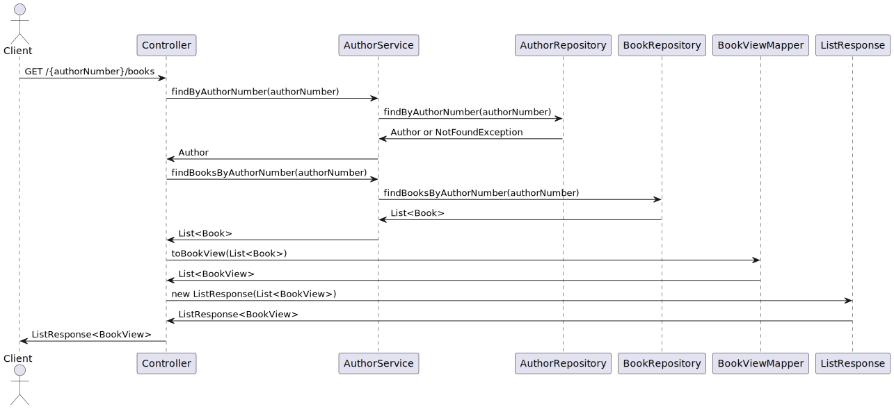

# WP #1B - Authors - Know the books of an Author

## 1. Requirements Engineering
### 1.1. User Story Description

As Reader I want to know the books of an Author

### 1.2. Customer Specifications and Clarifications

>[View WP1B](..%2FWP1B-Authors.md)

>[Q: Como irá ser feita a pesquisa? Pelo nome do autor? Pelo authors number?  ](https://moodle.isep.ipp.pt/mod/forum/discuss.php?d=29862)
>
>A: Devem pensar em termos de recursos rest e em subrecursos, não em “pesquisas”

>[Q:
Quando se refere "em termos de recursos rest e em subrecursos" 
> quer dizer o que? Podemos assumir para ambos os casos que o cliente ja tem o link para o autor?
](https://moodle.isep.ipp.pt/mod/forum/discuss.php?d=29862)
>
>A: Exato.

### 1.3. Acceptance Criteria
- Deve retornar a lista de livros desse autor ou uma lista vazia. devem ter em consideração paginação se a lista for demasiado longa

### 1.4. Found out Dependencies
- The reader must be authenticated in the system
- Books repository
### 1.5 Input and Output Data

**Input Data:**

* Typed data:
  * Authors number

**Output Data:**

* Books of an author
* (In)success of the operation

## 2. Design
### 2.1. Sequence Diagram (SD)

### 2.2. Class Diagram (CD)

## 3. Observations
It was assumed, in response to this user story,
that the author search was conducted using the
only unique attribute they have. This attribute is
the author number, which is why it is implemented
this way.

